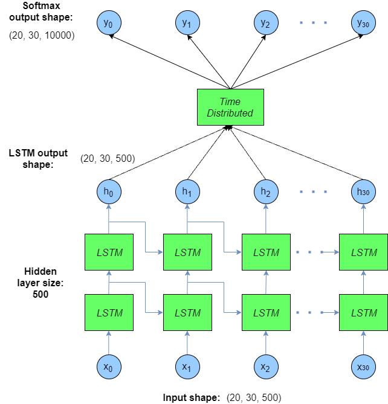
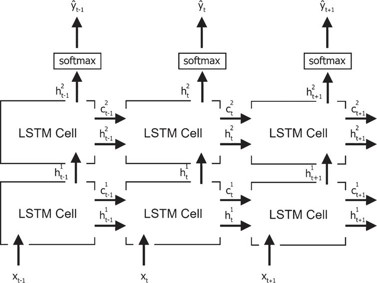
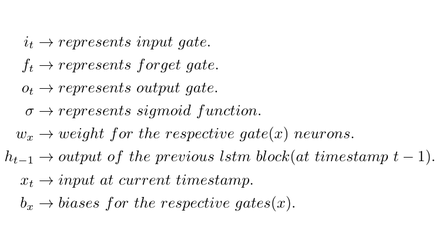
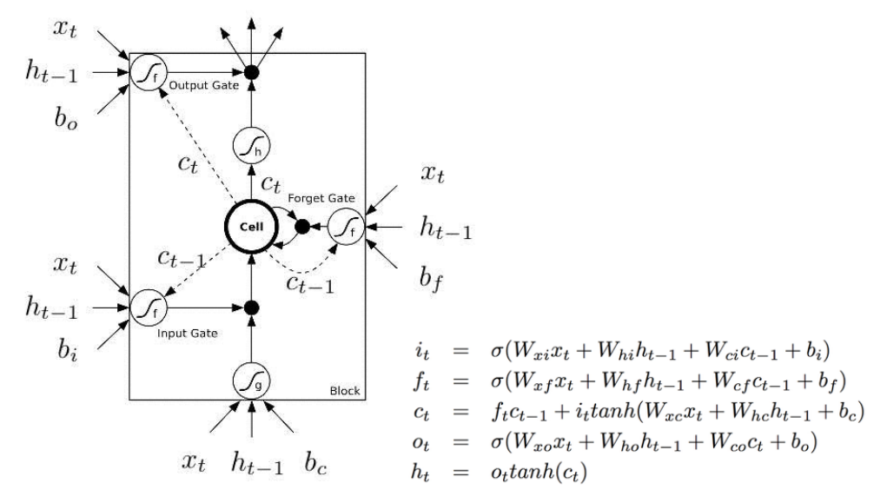
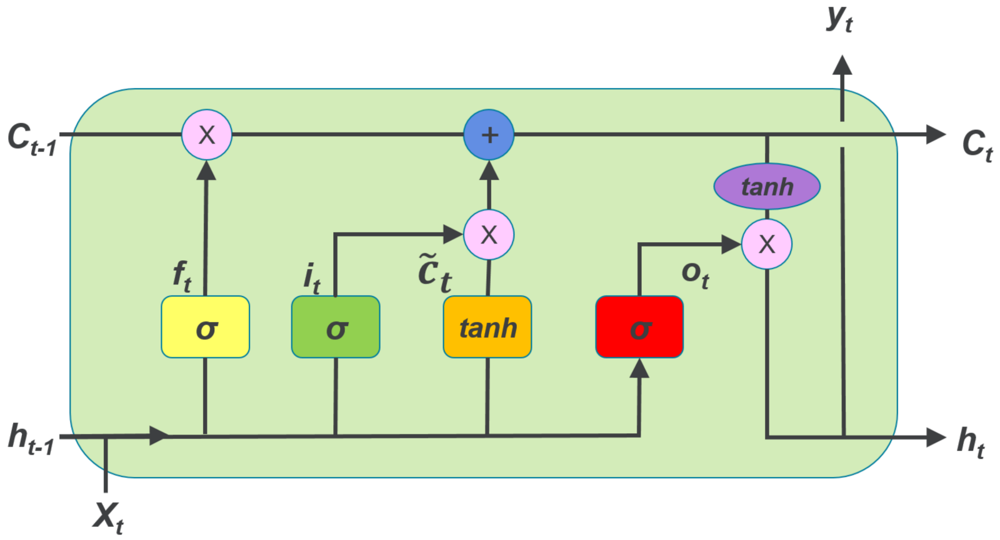
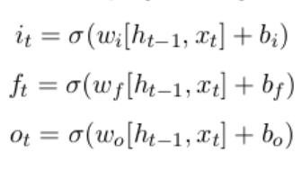

# LSTM Networks
## Sequence Models
In a feed-forward there is no state maintstate maintained by the network at all. In sequence models there is some sort of dependence through time between the inputs.Its output could be used as part of the next input, so that information can propogate along as the network passes over the sequence. In RNN you have the problem of a shrinking gradient. A gradient shrinks when its backpropagate through time, so earlier networks doesn't learn so much. Thus these kind of networks only have a small memory. 

## LSTM
A Long-short Term Memory network (LSTM) is a type of recurrent neural network designed to overcome problems of basic RNNs so the network can learn long-term dependencies. Specifically, it tackles vanishing and exploding gradients – the phenomenon where, when you backpropagate through time too many time steps, the gradients either vanish (go to zero) or explode (get very large) because it becomes a product of numbers all greater or all less than one. 
In the case of an LSTM, for each element in the sequence, there is a corresponding hidden state ht, which in principle can contain information from arbitrary points earlier in the sequence.

## Shared weights of LSTM model
- The 'shared weights' perspective comes from thinking about RNNs as feedforward networks unrolled across time. 
- If the weights were different at each moment in time, this would just be a feedforward network.
- If you did this, the number of parameters would grow linearly with the number of time steps. That would be a big explosion of parameters for sequences of any appreciable length. 
- It would indeed make the network more powerful, if you had the massive computational resources to run it and the massive data to constrain it. 
- For long sequences, it would probably be computationally infeasible and you'd get overfitting. 
- Interestingly, RNNs can still learn temporal structure that extends beyond the truncation length, because the recurrent units can store memory from before.

## Gates of LSTM:
Gates = neural network which decise wheter information pass a gate or not. Gates in LSTM are the sigmoid activation functions because we want a gate to give only positive values and should be able to give us a clear cut answer whether, we need to keep a particular feature (1) or we need to discard that feature (0).  
LSTM will have 3 gates:
- $f_t$ : forget gate  
- $i_t$ : input gate 
- $o_t$ : output gate 

## Terminology of Vectors
- $c_{t-1}$ = Previous memory (cell state)
- $h_{t-1}$ = Previous output (predition)
- $x_{t}$ = Current input vector
- $h_{t}$ = Current output (prediction)
- $c_{t}$ = Current memory (cell state)

A LSTM has two “hidden states”: c_t  and h_t . Intuitively, c_t  is the “internal” hidden state that retains important information for longer timesteps, whereas h_t is the “external” hidden state that exposes that information to the outside world.

## Activation Functions in LSTM
Traditionally, LSTMs use the tanh activation function for the activation of the cell state and the sigmoid activation function for the node output. Given their careful design, ReLU were thought to __not__ be appropriate for Recurrent Neural Networks (RNNs) such as LSTM because they can have very large outputs so they might be expected to be far more likely to explode than units that have bounded values.

## Shape of input data
If in pytorch parameter `batch_first` is true, then the input and output tensors are provided as (batch, seq, feature).

Batch - The batch size defines the number of samples that will be propagated through the network simultaneously. 

Sequence - This is equivalent to the amount of time steps you run your recurrent neural network. If you want your network to have memory of 60 time steps, this number should be 60.

Feature - this is the amount of features in every time step. If you are processing pictures, this is the amount of pixels.

## Types of LSTM models
### Vanilla LSTM
A Vanilla LSTM is an LSTM model that has a single hidden layer of LSTM units, and an output layer used to make a prediction.

### Stacked LSTM
Multiple hidden LSTM layers can be stacked one on top of another in what is referred to as a Stacked LSTM model. Given that LSTMs operate on sequence data, it means that the addition of layers adds levels of abstraction of input observations over time. A Stacked LSTM architecture can be defined as an LSTM model comprised of multiple LSTM layers. An LSTM layer above provides a sequence output rather than a single value output to the LSTM layer below.

The input shape of the data is ordered as follows : (batch size, number of time steps, feature size). In other words, for each batch sample and each data in the number of time steps, there is a vector to represent the current machine state. These  vectors will be learnt as part of the overall model learning. The input data is then fed into two “stacked” layers of LSTM cells (of 8 lengh feature size) – in the diagram above, the LSTM network is shown as unrolled over all the time steps. The output from these unrolled cells is still (batch size, number of time steps, hidden size).

### Bidirectional LSTM
On some sequence prediction problems, it can be beneficial to allow the LSTM model to learn the input sequence both forward and backwards and concatenate both interpretations.
In time-series data, such as device readings from IoT devices or the stock market, using a bi-directional model wouldn't make sense, as we would be violating the temporaneous flow of information i.e. we cannot use information from the future to help predict the present. That isn't a problem in text analysis, voice-recordings or network analysis on sub-network traffic flow.

### CNN LSTM
A convolutional neural network, or CNN for short, is a type of neural network developed for working with two-dimensional image data.

### ConvLSTM
A type of LSTM related to the CNN-LSTM is the ConvLSTM, where the convolutional reading of input is built directly into each LSTM unit.
The ConvLSTM was developed for reading two-dimensional spatial-temporal data, but can be adapted for use with univariate time series forecasting.

## Architecture of LSTM Cell
Terminology:

### Version A

### Version B 
This architcture seems to be the most popular one and is used by Prof. Niggemann

