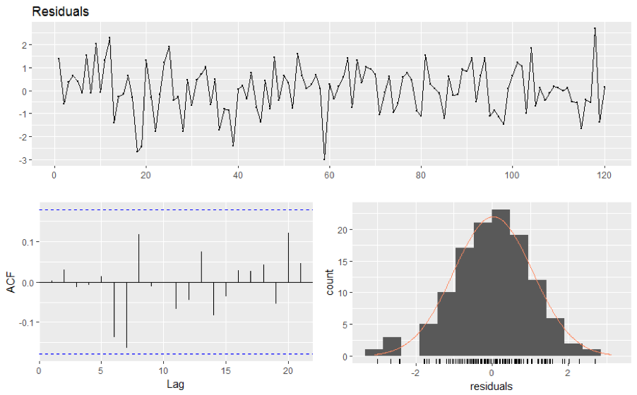

# Time Series
## Time Series Components
__Trend:__  
- A trend exists when a series increases or decreases with respect to time. Therefore, the time is taken as a feature. 

__Seasonality:__  
- This refers to the property of a time series that displays periodical patterns that repeats at a constant frequency (m)

## Residuals diagnostics
- After a forecasting model has been fit, it is important to assess how well it is able to capture patterns. 
- While evaluation metrics help determine how close the fitted values are to the actual ones, they do not evaluate whether the model properly fits the time series.
- Instead, the residuals are a good way to evaluate this. - As you are trying to capture the patterns of a time series, you would expect the errors to behave as white noise, as they represent what cannot be captured by the model. 
- White noise must have the following properties:
   - The residuals are uncorrelated (Acf = 0)
   - The residuals follow a normal distribution, with zero mean (unbiased) and constant variance
   
- the first property can be verified like this:
   - Plot the Autocorrelation function (ACF) and evaluate that at least 95% of the spikes are on the interval $-\frac {2}{\sqrt{T}}, \frac {2}{\sqrt{T}}$ where T is the size of the time series.
- If either of the two properties are not present, it means that there is room for improvement in the model.

## Autocorrelation

