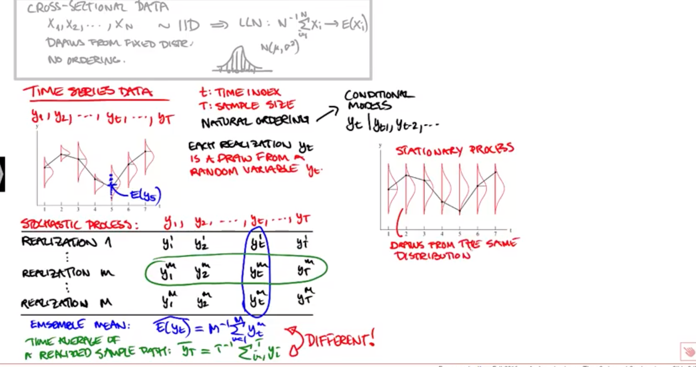

# Time Series
## Comparision to Cross-sectional data
- Cross-sectional data is a type of data collected by observing many subjects (such as individuals, firms, ...) at the same point of time, or without regard to differences in time. 
- Analysis of cross-sectional data usually consists of comparing the differences among the subjects.
- The datapoints must be indipendent and identically distributed 

## Stationarity of time series
- the realization is a draw from a random variable (draw out of a distribution)
- We are not capable of making multiple draws out of history (realization 1 to realization M): So we have only one realisation of the stochastic process
    - Trick: We say that each realization of the time series is a draw from the same distribution 
- Conclusion: A time series is stationary if the distribution function is not a function of t (is constant over time). So two subsamples of a timeseries have the same underlying distribution

### Weak stationarity
- Mean is constant and doesn't depent on t
- Variance is constant and doesn't dpent on t
- Covariance has to only depent on the distance between two observations within a time series

### Weak dependency
- $y_{t}$ and $y_{t-h}$ are approx. indipendent for h to infinity
- That implies, that each observation contains new information about the underlying distribution

--> Weak stationarity + weak dependency: $\overline{y_t}$ --> $E(y_t)$  
--> Weak stationarity + weak dependency repalce the indipendent and identically distributed assumption when working with cross-sectional data

- In general time series are not really different from other machine learning problems - you want your test set to 'look like' your training set, because you want the model you learned on your training set to still be appropriate for your test set. 
- That's the important underlying concept regarding stationarity. Time series have the additional complexity that there may be long term structure in your data that your model may not be sophisticated enough to learn. For example, when using an autoregressive lag of N, we can't learn dependencies over intervals longer than N. Hence, when using simple models like ARIMA, we want data to also be locally stationary.
- Stationary means the model's statistics don't change over time ('locally' stationary). If you separated your training set into two intervals and trained on them separately, and got two very different models - what would you conclude from that? These issues arise if the data is 'non-stationary'.

## Why time series data is unique
- A time series is a series of data points indexed in time. 
- The key point about time series data is that the ordering of the time points matters. For many sets of data (for example, the heights of a set of school children) it does not really matter which order the data are obtained or listed. One order is good as another. For time series data, the ordering is crucial.
- Serial dependence occurs when the value of a datapoint at one time is statistically dependent on another datapoint in another time. 
- However, this attribute of time series data violates one of the fundamental assumptions of many statistical analyses — that data is statistically independent.
   - In probability theory, two events are statistically independent if the occurrence of one does not affect the probability of occurrence of the other 

## Time Series Components
__Trend:__  
- A trend exists when a series increases or decreases with respect to time. Therefore, the time is taken as a feature. 

__Seasonality:__  
- This refers to the property of a time series that displays periodical patterns that repeats at a constant frequency (m)

## Residuals diagnostics
- After a forecasting model has been fit, it is important to assess how well it is able to capture patterns. 
- While evaluation metrics help determine how close the fitted values are to the actual ones, they do not evaluate whether the model properly fits the time series.
- People often use the residuals to assess whether their model is a good fit while ignoring that assumption that the residuals have no autocorrelation
- As you are trying to capture the patterns of a time series, you would expect the errors to behave as white noise, as they represent what cannot be captured by the model. 
- White noise must have the following properties:
   - The residuals are uncorrelated (Acf = 0)
   - The residuals follow a normal distribution, with zero mean (unbiased) and constant variance
   
- the first property can be verified like this:
   - Plot the Autocorrelation function (ACF) and evaluate that at least 95% of the spikes are on the interval $-\frac {2}{\sqrt{T}}, \frac {2}{\sqrt{T}}$ where T is the size of the time series.
- If either of the two properties are not present, it means that there is room for improvement in the model.

## Autocorrelation
- Autocorrelation is a measure of the internal correlation within a time series
- It is a type of serial dependence. Specifically, autocorrelation is when a time series is linearly related to a lagged version of itself. 
- Values closer to plus or minus one indicate strong correlation
- For example, for the time series you might ask: “take an arbitrary spot in time, on the average what does the time series look like in four weeks time, compared to now? ”
- A negative autocorrelation implies that if a particular value is above average the next value (or for the number of the lag) is more likely to be below average. 

## Stationary Time Series
- A stationary time series is one whose statistical properties are constant over time:
   - the mean value of the series
   - the variance
   - and the autocorrelation. 

