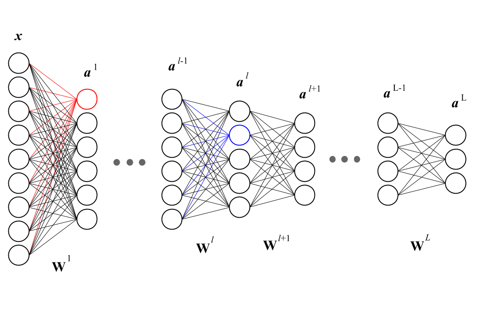
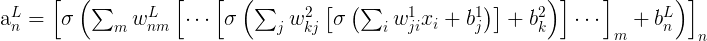
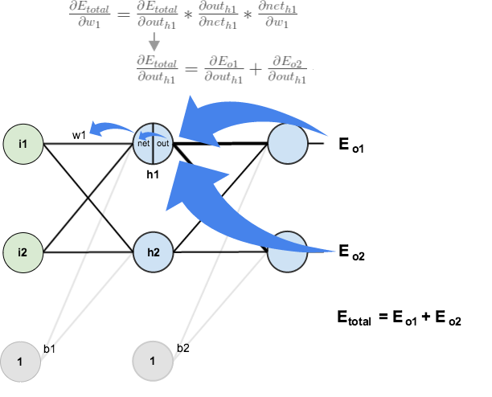

# Backpropagation
Neural networks are nothing more than composite (=zusammengesetzt) mathematical functions that are delicately tweaked (trained) to output the required result. NN are the compositions of functions on matrices.  

Here you can see the NN written as a nested function:

  
## Math Basics
- A scalar valued function is a function that takes one or more values but returns a single value. f(x,y,z) = x+2y+5z is an example of a scalar valued function. 
- A vector valued function is a function which takes a real number, t, as an input and returns a vector as an output. 
- The derivative of a scalar function at a certain point, gives the rate of which this function is changing its values at this point. 
- We use a partial derivate when the input of a function is made up of multiple variables, we want to see how the function changes as we let just one of those variables change while holding all the others constant. 
- The gradient of a function f, denoted as ∇f, is the collection of all its partial derivatives into a vector. Thus gradient measures how much the output of a function changes if you change the inputs a little bit.
- The chain rule is a formula for computing the derivative of the composition of two or more functions (like NN).In a way, back propagation is just fancy name for the chain rule.
- Let’s call y the output vector of f. The Jacobian matrix of f contains the partial derivatives of each element of y, with respect to each element of the input x. This matrix tells us how local perturbations the neural network input would impact the output.

  
 

## Gradients
A loss (error) function E = L(t,y) is used for measuring the discrepancy between the expected output t and the actual output y. This loss function should be as small as possible. 
We can ask ourselves the following question: How much the total error will change if we change the internal weight of the neural network with a certain small value δW.

  
 
  

We want to know the rate of which the error changes relatively to the changes on the weight.
- If the derivative is positive, meaning the error increases if we increase the weights, then we should decrease the weight.
- If it’s negative, meaning the error decreases if we increase the weights, then we should increase the weight.

## Gradient descent method
This error is now propagated back to the input layer through the output layer. This method is called backpropagation and uses the gradient descent method. It is an optimization algorithm that minimizes a given loss function by finding better weights of the NN.
It involves calculating the derivative of the loss function with respect to the weights of the network. The weights of the neuron connections are changed through gradient descent mehtod depending on their influence on the error. This guarantees an approximation to the desired output when re-creating the input. The computed gradient is used to update the weight using a learning rate:  
`New weight = old weight - Derivative Rate * learning rate`
- If the derivative rate is positive, it means that an increase in weight will increase the error, thus the new weight should be smaller.
- If the derivative rate is negative, it means that an increase in weight will decrease the error, thus we need to increase the weights.

### Different types of gradient descent method
There are three popular types of Gradient Descent, that mainly differ in the amount of data they use:
- Batch gradient descent
- Stochastic gradient descent
- Mini batch gradient descent

#### Batch gradient descent
Batch gradient descent (vanilla gradient descent) calculates the error for each example in the training dataset, but only updates the model after all training examples have been evaluated in the end of each training epoch. 

__Upsides__
- Fewer updates to the model means this variant of gradient descent is more computationally efficient. 
- The decreased update frequency results in a more stable error gradient and may result in a more stable convergence on some problems.

__Downsides__
- The more stable error gradient may result in premature (=verfrüht) convergence of the model to a less optimal set of parameters.
- The updates at the end of the training epoch require the additional complexity of accumulating prediction errors across all training examples.
- Model updates may become very slow for large dataset because it requires that the entire btraining dataset is in memory and available to the algorithm.

#### Mini batch gradient descent
A mini batch is a smaller part of the entire data set, so a few data propagated through the network simultaneously. 
The mini batch gradient descent calculates the error for each example in that batch and updates the model after the mini batch. 
Implementations may choose to sum the gradient over the mini-batch or take the average of the gradient which further reduces the variance of the gradient.  
Mini-batch gradient descent seeks to find a balance between the robustness of stochastic gradient descent and the efficiency of batch gradient descent.

__Upsides__
- The model update frequency is higher than batch gradient descent which allows for a more robust convergence, avoiding local minima.
- The batched updates provide a computationally more efficient process than stochastic gradient descent.

__Downsides__
- Mini-batch requires the configuration of an additional “mini-batch size” hyperparameter for the learning algorithm.
- Error information must be accumulated across mini-batches of training examples like batch gradient descent.

#### Stochastic gradient descent
Stochastic gradient descent (SGD) calculates the error and updates the model for each example in the training dataset.

__Upsides__
- The increased model update frequency can result in faster learning on some problems.
- The noisy update process can allow the model to avoid local minima (e.g. premature convergence).

__Downsides__
- Updating the model so frequently is more computationally expensive 
- The frequent updates can result in a noisy gradient signal, which may cause the model parameters and in turn the model error to jump around
- The noisy learning process down the error gradient can also make it hard for the algorithm to settle on an error minimum for the model.
