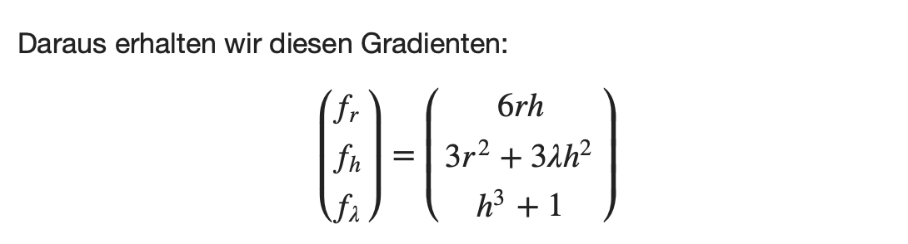
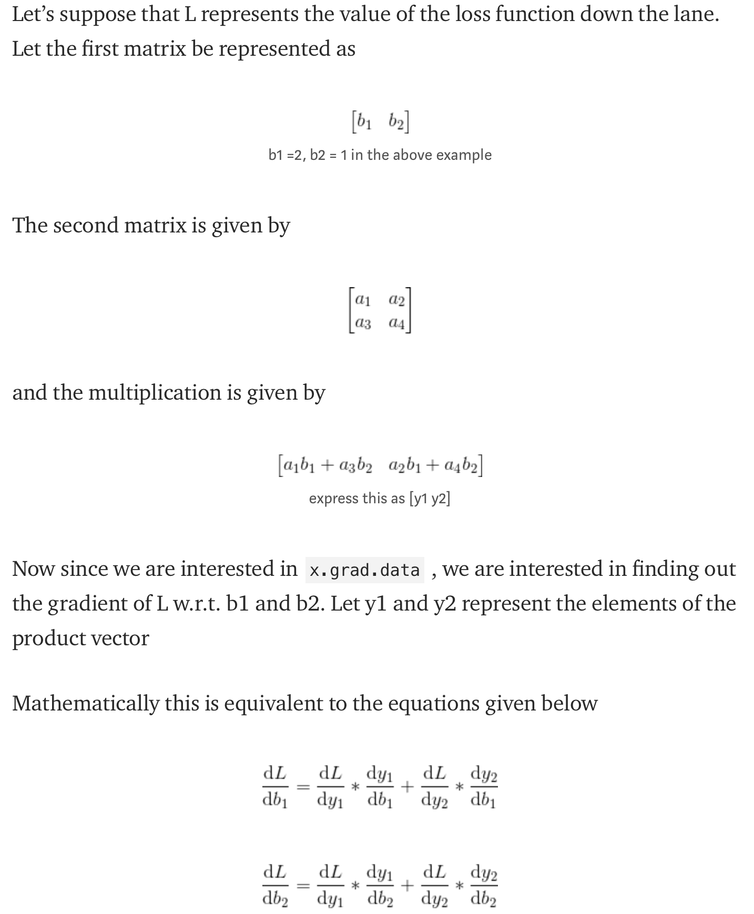
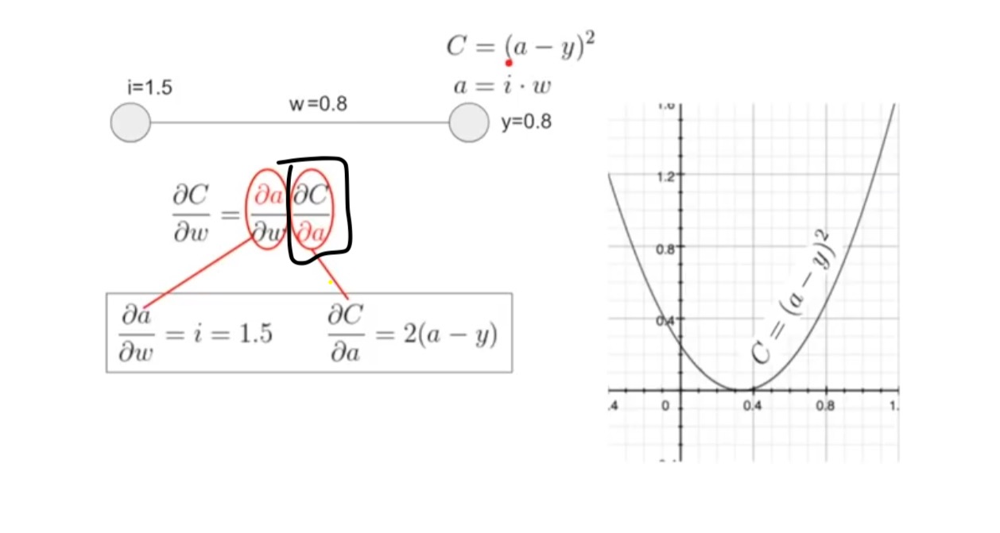

# Write own Loss Function in Pytorch
Modern neural network architectures can have millions of learnable parameters. From a computational point of view, training a neural network consists of two phases:
- A forward pass to compute the value of the loss function.
- A backward pass to compute the gradients of the learnable parameters.

## Gradient
Der Gradient einer Funktion ist ein Vektor, dessen Einträge die ersten partiellen Ableitungen der Funktion sind.

Der erste Eintrag ist die partielle Ableitung nach der ersten Variable, der zweite Eintrag die partielle Ableitung nach der zweiten Variable und so weiter.

Jeder Eintrag gibt dabei den Anstieg der Funktion in Richtung der Variablen an, nach der abgeleitet wurde.


$g(r,h,λ)=3*r^{2}*h+λ*h^{3}+λ$



Der Gradient der Loss-Function in Abhänigkeit von dem Output des Models ist die partielle Ableitung (in diesem Fall nur nach x da nur ein Output).




## Backward pass
loss.backward() computes dloss/dx for every parameter x in the model which has requires_grad=True. These are accumulated into x.grad for every parameter x.


## nn.Module vs autograd.Function
There is a difference between a costum function and a costum module:
1. If you want to create a custom function and torch have enough function to code it (torch.pow(), torch.sum(), +, -, ...) , you should use nn.Module as a base, because you don't have to implement backward pass with partial derivation. So use nn.Module if you are not using any special-external library (like scipy, nlp etc. for computation) 
2. If you use special functions which are not implemented in torch, you have to create a cusotm function. A custom function inherits from autograd.Function requires to have backward pass coded by user.

## Code of own nn.Module
```python
class Gaussian(nn.Module):
    def forward(self, input,sigma,center):
        dist1=center-input
        dist=torch.pow(dist1,2)
        dist2=torch.sum(dist,1)
        sigma2=torch.pow(sigma,2)
        dist=-1/2*sigma2*dist2
        output=torch.exp(dist)
        return output 
```

--> All functions insinde forward method are torch functions and thats why backward pass is calculated automatically. 


## Code of own autograd.Function
In the backward pass we receive a Tensor containing the gradient of the loss with respect to the output, and we need to compute the gradient of the loss with respect to the input.
--> This is the difficult part: Define the partial derivative of the loss function w.r.t. to all input variables. Input variables of a loss function is y_pred <br>
It is the implementation of the chain-rule and a piece of the hole chain: 
```
grad_input = [derivate forward(input) wrt parameters] * grad_output
```



```python
class OwnLossFunction(Function):

    @staticmethod
    # bias is an optional argument
    def forward(ctx, output, target_data):
        # Select and transform data
        target_data = torch.squeeze(target_data)
        ctx.save_for_backward(output, target_data)
        
        # Compute loss
        term = (target_data-output)**2
        loss_batches = torch.sum(input=term, dim=1)
        mean_loss = torch.sum(loss_batches)/hyperparam['model']['batch_size']
        return mean_loss
    
    @staticmethod
    def backward(ctx, grad_output):
        """
        grad_output = [1], because it is initialize by Optimizer 
        In the backward pass we need to compute the gradient of the loss
        with respect to the input. multiplyed by grad_output
        """
        output, target_data = ctx.saved_tensors # this is a tensor of models output
        # grad_input = [derivate forward(input) wrt parameters] * grad_output
        # It is the implementation of the chain-rule
        grad_input = 2.*(output-target_data) * grad_output
        return grad_input, None
```

## Links
- https://pytorch.org/docs/stable/notes/extending.html
- https://pytorch.org/tutorials/beginner/examples_autograd/two_layer_net_autograd.html
