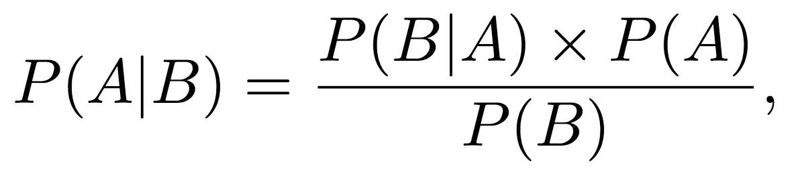
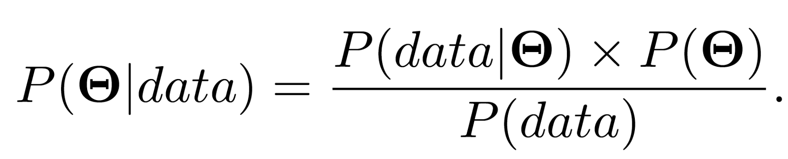

## Bayes'Theorem
- What makes it useful is that it allows us to use some knowledge or belief that we already have (commonly known as the prior) to help us calculate the probability of a related event
   - For example, if we want to find the probability of selling ice cream on a hot and sunny day, Bayes’ theorem gives us the tools to use prior knowledge about the likelihood of selling ice cream on any other type of day (rainy, windy, snowy etc.)

- A and B are events
- P(A|B) is the conditional probability that event A occurs given that event B has already occurred 
- P(B|A) has the same meaning but with the roles of A and B reversed
- P(A) and P(B) are the marginal probabilities of event A and event B occurring respectively.
- P(A) is the expression that is known as the prior. 

### How to get a prior probability / distriburion? 
- It’s possible for someone to come up with a prior that is an informed guess from personal experience or particular domain knowledge without having data available but it’s important to know that the resulting calculation will be affected by this choice.

## Bayes Inference
- Instead of single probabilities you can use distributions in BayesTheorem
   - a prior probability is now a prior distribution
- (Statistical) inference is the process of deducing (=folgern) properties about a population or probability distribution from data.
- Bayesian inference is therefore just the process of deducing properties about a population or probability distribution from data using Bayes’ theorem.

- Instead of event A, we’ll typically see Θ, this symbol is called Theta which represents the set of parameters (if we’re trying to estimate the parameter values of a Gaussian distribution then Θ represents Θ = {μ, σ}).
- Instead of event B, we’ll see data (y = {y1, y2, …, yn})
- P(Θ) is the prior distribution
- P(Θ|data) on the left hand side is known as the posterior distribution. This is the distribution representing our belief about the parameter values 
- P(data| Θ) it’s the likelihood distribution
- It turns out that calculating P(data) is very hard. The reason why P(data) is important is because the number that comes out is a normalising constant. One of the necessary conditions for a probability distribution is that the sum of all possible outcomes of an event is equal to 1. The normalising constant makes sure that the sum (integral) of the distribution is equal to 1.

The fact that the posterior and prior are both from the same distribution family (they are both Gaussians) means that they are called conjugate distributions. In this case the prior distribution is known as a conjugate prior.

In many inference situations likelihoods and priors are chosen such that the resulting distributions are conjugate because it makes the maths easier. 

## Update your beliefs with new data
- In fact, the Bayesian framework allows you to update your beliefs iteratively in realtime as data comes in. 
- You have a prior belief about something (e.g. the value of a parameter) and then you receive some data. 
- You can update your beliefs by calculating the posterior distribution like we did above. So our posterior becomes the new prior. We can update the new prior with the likelihood derived from the new data and again we get a new posterior. 

