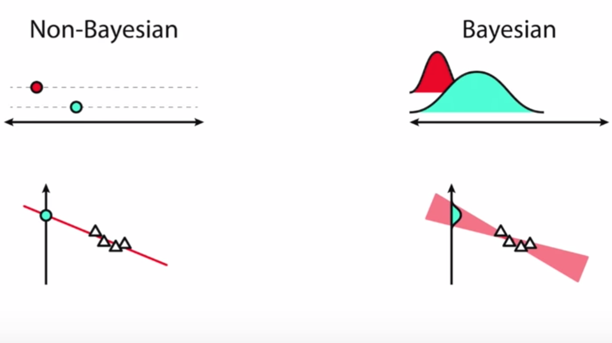
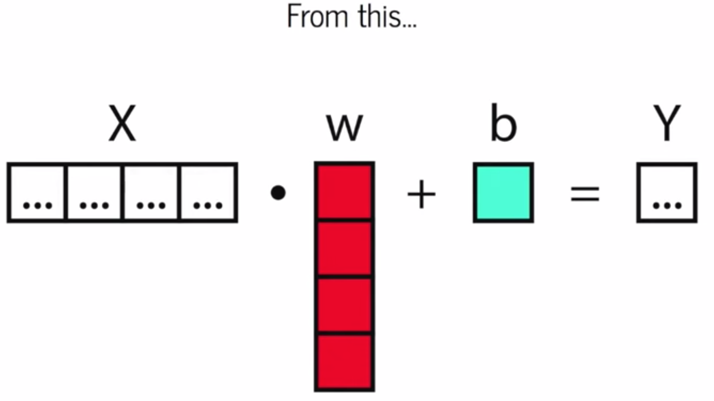
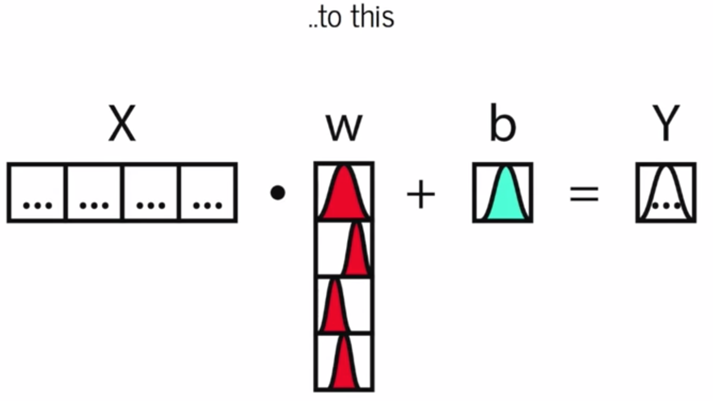
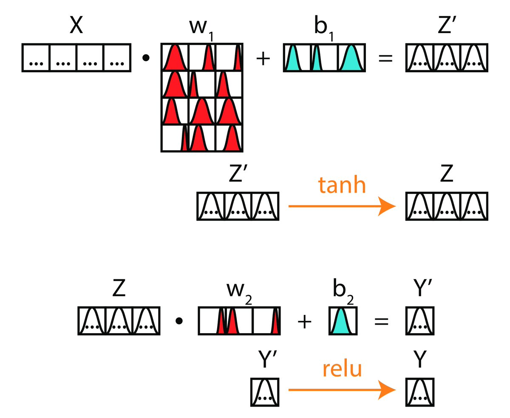
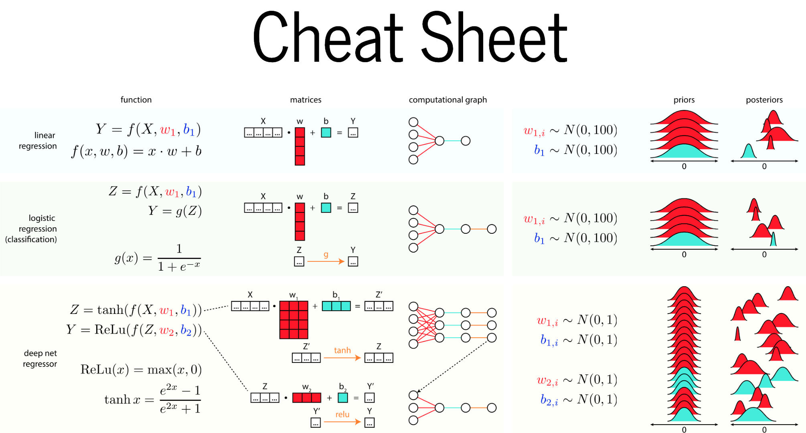
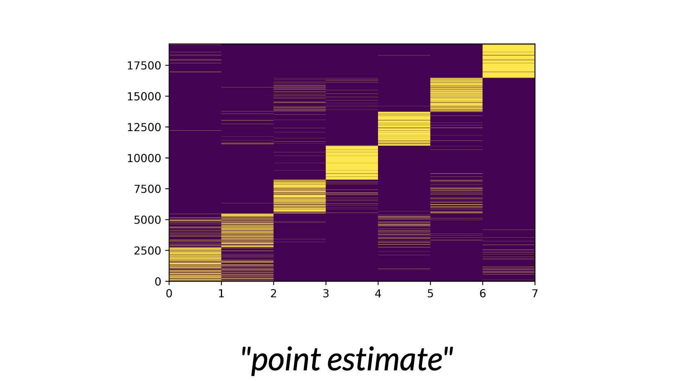
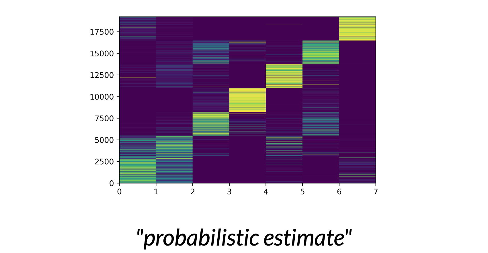
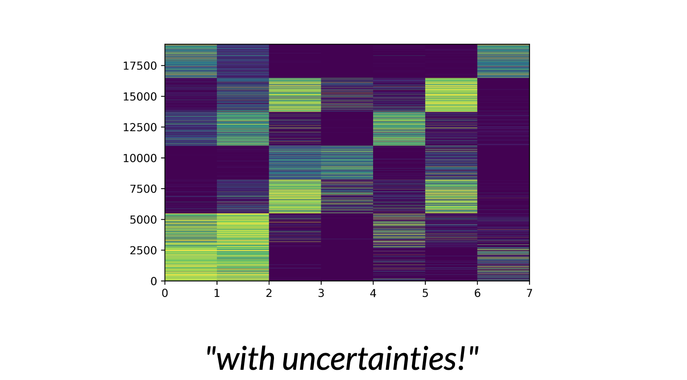

- In order to use machine learning we need to consider uncertanty
- To combine data with model, we need:
   - prediction function f
   - objective function E (loss function)
- Uncertanty arises from
   - few data
   - mismatch between the set of prediction functions we choose and all possible functions
   - objective (=Zielsetzung)
- In statistics activation functions are known as basis functions
   - is a linear model: not linear in predictions, linear in parameters (A model is linear when each term is either a constant or the product of a parameter and a predictor variable (x))
- Prediction function of one hidden layer: $f(x) = w^{(2)^T} \phi\ (W_1,x)$
   - In ML we optimize $W_1$
- If we want to predict probablisticly, we want to have a joint probability distribution that tells you how every variable you observed is related to each other. 
- Probablistically we want $p(y_*,|y, X, x_*)$, $y_*$ is a test output, $x_*$ is a test input, X is a training input matrix, y is training outputs
- Then you want to make a prediction about $y_*$ conditioning over everything I observed.
- Bayes Rule: Give parameter based on the underliying data

# Baysian deep learning
- In vanilla neural nets (normal NN) we learn a single estimate of a parameter and say, this parameter helps us best to explain the outcome
- On the other side Baysian NN is grounded on learning a probability distribution for each parameter rather than point estimates
- So every parameter is a variable with other parameters like variance and mean
- We learn what the probability densety is over parameter space 

- The moment you treat any of your parameters as random variables you get an expectation and a variance. All the uncertanty gets propagated down the final output 

- In the non bayesian framework we shift the parameter-points in order to best fit our output. In the bayesian framework we shift  parameter-distributions in order to best fit our output. 

- Use a natural gausian distribution N(0, 1) for NN's parameters

- With bayesian framework we can predict something (e.g. a class) __and__ give the uncertanty about this prediction

Probability mass associated with each class: 

The quantifyed uncertanty, taking the standard deviation of the posterior samples: 

With the point estimate it looks like we are able to distinguish between class 1 and class 2, but considering the uncertanty we are not actually clear about this differentiation. Sollution: Built a extra classifyer for the prediction of class 1 and 2 (use ensembles). 

--> In some places the uncertanty really matters. 

Downsides:
- Training is 20 times more expensive. 