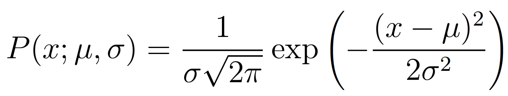
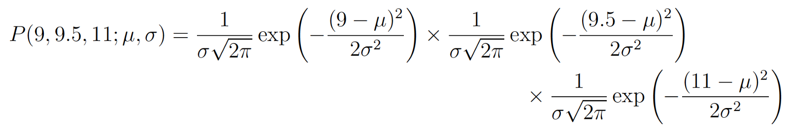
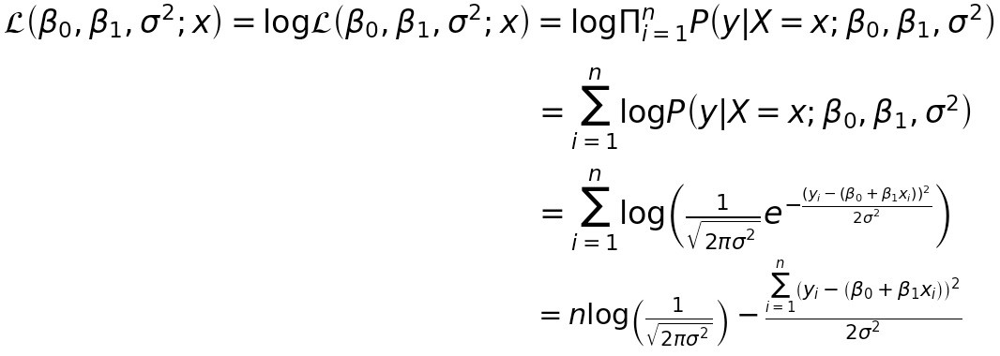

## Likelihood 
- The goal of maximum likelihood is to find the optimal way to fit a distribution to given data.
-  MLE in a nutshell helps us answer this question: Which are the best parameters/coefficients for my model?
- The parameter values are found such that they maximise the likelihood that the process described by the model produced the data that were actually observed.
- The Gaussian distribution has 2 parameters. The mean, μ, and the standard deviation, σ. 
- Different values of these parameters result in different curves of the distribution function. 
- We want to know which curve (distribution with it’s parameter) was most likely responsible for creating the data points that we observed? 
- Maximum likelihood estimation is a method that will find the values of μ and σ that result in the curve that best fits the data.

## Independency of Data 

## Calculate the Likelihood
- What we want to calculate is the total probability of observing all of the data, i.e. the joint probability distribution of all observed data points. 
- The likelihood function is, in fact, a conditional probability. It is dependent on the parameter, because we'll only pick the value for the parameter that maximizes the probability of observing the data.
- So we need to calculate some conditional probabilities, which can get very difficult. 
- To make the maths easier we’ll make assumptions. The assumption is that each data point is generated independently of the others. 
- If the events (i.e. the process that generates the data) are independent, then the total probability of observing all of data is the product of observing each data point individually (i.e. the product of the marginal probabilities).
- The probability density of observing a single data point x, that is generated from a Gaussian distribution is given by:

Calculation for three points (Because each data point is independent of each other, the probability of all points in the dataset is expressed as a product)

Mor general: 

- All we have to do is find the derivative of this function, set the derivative function to zero and then rearrange the equation to make the parameter of interest the subject of the equation and we have our MLE values for our parameters.
- The above expression for the total probability is actually quite a pain to differentiate, so it is almost always simplified by taking the natural logarithm of the expression.
- This is absolutely fine because the natural logarithm is a monotonically increasing function. 
- This means that if the value on the x-axis increases, the value on the y-axis also increases
- This is important because it ensures that the maximum value of the log of the probability occurs at the same point as the original probability function. 
- Therefore we can work with the simpler log-likelihood instead of the original likelihood.

A few assumptions about our dataset:
- Each data point is independent
- Our dataset follows a Normal distribution
- The error in our model also follows a Normal distribution
- Our output is continuous

## Probability vs. Likelihood

These expressions are equal! So what does this mean? Let’s first define P(data; μ, σ). It means “the probability density of observing the data with model parameters μ and σ”.

On the other hand L(μ, σ; data) means “the likelihood of the parameters μ and σ taking certain values given that we’ve observed a bunch of data.”

The equation above says that the probability density of the data given the parameters is equal to the likelihood of the parameters given the data. But despite these two things being equal, the likelihood and the probability density are fundamentally asking different questions — one is asking about the data and the other is asking about the parameter values.

## Joint probability distribution
